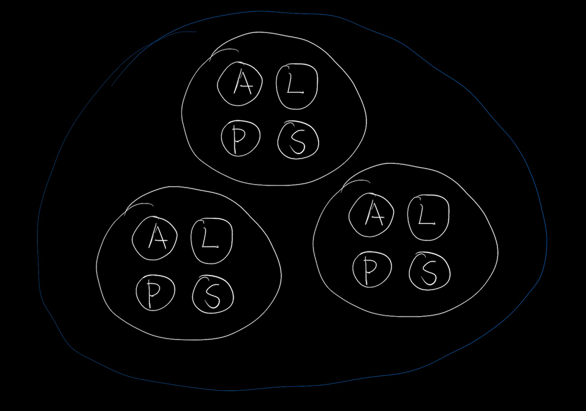
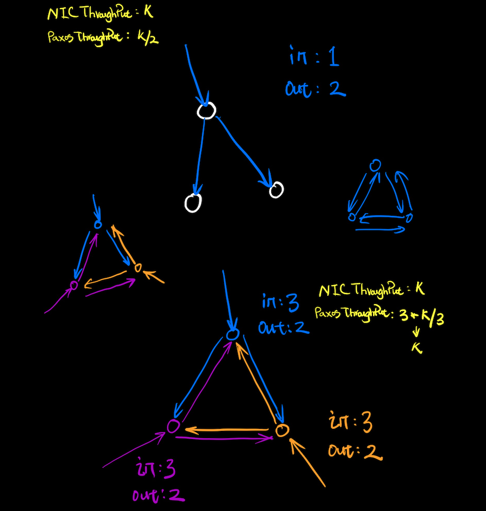

# Veela的初步目标草稿

## 基础功能

* 正确性与安全性（**生命线**）
* 乱序提交
* Batch & Pipeline 优化与自适应调整
* 灵活的成员组织变更（新老成员组之间可不必有交集）
* 绝大多数情况一次成功提交耗时为一次rtt
* 用户可选择自定义网络层、存储层或者直接使用默认实现

## 特性

### 灵活的选主策略

基于优先级的选主，支持单Leader、多Leader、Leader身份变更等一系列灵活的控制操作。

### 节点角色自由定制组合

```
A -- Acceptor
L -- Learner
P -- Proposer
S -- State Machine Replication Executor
```

比如传统三节点角色组合如下：



在对角色进行自定义组合之后，一种可能的用法如下：


### 网络吞吐

假设Paxos的任一角色在和其它角色进行通信时均使用同一个网卡，此网卡入网、出网最大带宽均为 K *bps*，那么有如下结论：



* 三节点、单Leader模式下，Paxos最大吞吐为K/2

* 三节点、三Leader模式下，Paxos最大吞吐为K

  ... ...

### 广域网优化

根据带宽、延迟，对Batch与Pipeline参数进行动态自适应调整，以达到整体最优吞吐。

### 磁盘吞吐

在不考虑压缩的情况下，应能无限接近磁盘文件`append+fsync`时的最大吞吐性能，即应达到单磁盘极限速率。

为了最大化磁盘吞吐，Veela并没有使用通用的kv存储，而是针对Paxos算法定制了一款日志型存储 -- [logdb](https://github.com/turingcell/veela/blob/main/logdb/logdb.go)。

### 使用AcceptValueID以提高网络传输效率

Veela给每个不同的AcceptValue分配一个在此Paxos Instance中唯一的ID，在此机制之上可以衍生出很多优化方法，以提高网络资源的有效使用率。

比如Paxos的角色之间在进行通信时，请求者可以携带己方已经知晓的AcceptValue的ID集合，以减少冗余信息在网络中的传输，通过类似的方法能显著降低多个Proposer在碰撞时所带来的网络消耗，以及降低help-proposed PA操作中的网络消耗，等等。

AcceptValueID的具体定义和简短的正确性证明如下：

一个AcceptValue在第一次进入Paxos Instance之中时，一定是通过某个self-proposed PA操作中的Accept请求进入的，我们称此PA操作的e值为这个AcceptValue的ID，易证此e值在当前Paxos Instance中是唯一的。

任意一个help-proposed PA操作中所提交的AcceptValue一定源于一个self-proposed PA操作中的AcceptValue（或者说二者相同），这样就能证明AcceptValueID和AcceptValue在此Paxos Instance中严格一一映射，即如果两个AcceptValue的ID相同，那么这两个AcceptValue一定相同。

又因为self-proposed PA操作在一个Paxos Instance中存在总数上限 `(N+1)/2` (N为成员数)，那么我们可以得出在一个Paxos Instance中最多可以拥有 `(N+1)/2` 个不同的AcceptValue，根据这个结论，我们发现即使我们把所有不同的AcceptValue全部存储起来，其磁盘空间总消耗也是存在上限的。

### 运行中持续的拜占庭错误检测

待补充。

